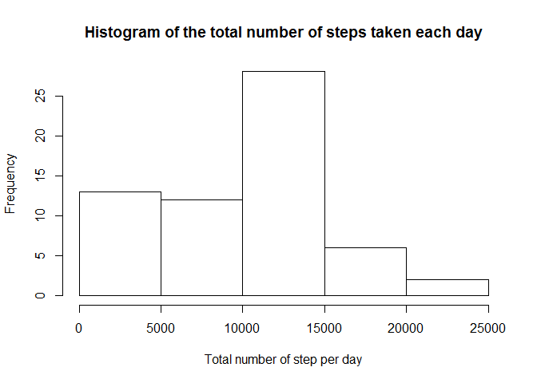
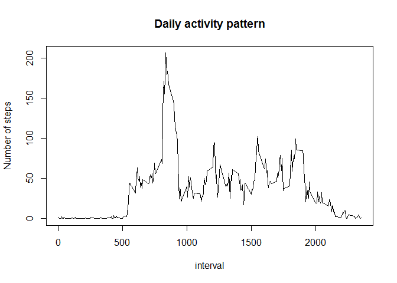
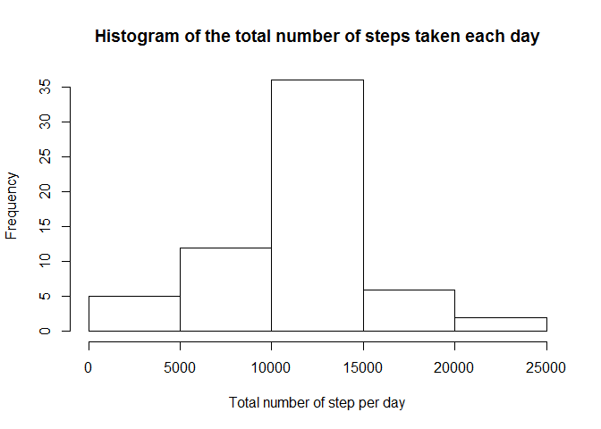
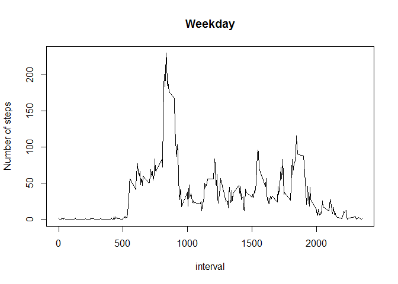
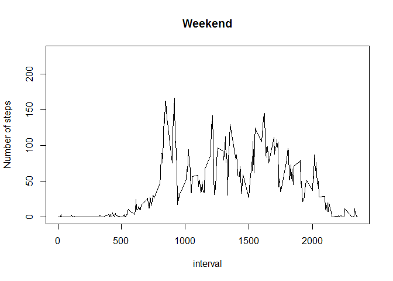

# Reproducible Research: Peer Assessment 1
josevidal  
17 de junio de 2017  


## Loading and preprocessing the data

```r
library(data.table)
```

```
## Warning: package 'data.table' was built under R version 3.3.2
```

```r
setwd("C:/Users/Dalvin/Documents/experian/ejemplos de R/Reproducible Research/week2/course_project")
#Load data
activity      <- read.csv( "activity.csv" )
#Transform variable date as a Date format
activity$date <- as.Date(activity$date, format = "%Y-%m-%d")
activity      <- as.data.table(activity)
```

## What is mean total number of steps taken per day?

```r
#Total number of steps taken per day
step <- activity[ , .(step_per_day = sum(steps, na.rm = T)), by=date]
#histogram of the total number of steps taken each day
hist(step$step_per_day, main ="Histogram of the total number of steps taken each day",
     xlab = "Total number of step per day")
```

<!-- -->

```r
#mean of the total number of steps taken per day
mean(step$step_per_day)
```

```
## [1] 9354.23
```

```r
#median of the total number of steps taken per day
median(step$step_per_day)
```

```
## [1] 10395
```

## What is the average daily activity pattern?


```r
#average number of steps taken across all days 
step<- activity[ , .(steps_int = mean(steps, na.rm = T)), by =interval]
plot(step, type = "l", ylab="Number of steps", main="Daily activity pattern")
```

<!-- -->

```r
#Interval with maximum number of steps
step[ which.max(step$steps_int), interval ]
```

```
## [1] 835
```

## Imputing missing values


```r
#total number of missing values in the dataset 
table(!complete.cases(activity))
```

```
## 
## FALSE  TRUE 
## 15264  2304
```

```r
#the mean steps by 5-minute interval and round to a integer
step <- activity[, .(mean_step = round(mean(steps, na.rm = T))), by=interval]
#Create and fill new data set with the mean steps by interval
activity_new<- activity
for (i in  step$interval){
    activity_new[interval==i & !complete.cases(activity_new), steps:=step[interval==i, mean_step]]
}
#Total number of step by date
step_total <- activity_new[ , .(step_per_day = sum(steps, na.rm = T)), by=date]
#histogram of the total number of steps taken each day
hist(step_total$step_per_day, main ="Histogram of the total number of steps taken each day",
     xlab = "Total number of step per day")
```

<!-- -->

```r
#mean of the total number of steps taken per day
mean(step_total$step_per_day)
```

```
## [1] 10765.64
```

```r
#median of the total number of steps taken per day
median(step_total$step_per_day)
```

```
## [1] 10762
```

```r
# > mean(step$step_per_day)
# [1] 9354.23
# > median(step$step_per_day)
# [1] 10395

# > mean(step_2$step_per_day)
# [1] 10765.64
# > median(step_2$step_per_day)
# [1] 10762
```

The mean of total number of steps difer in 1411.41 steps and the median difer in 367 steps. Imputing missing data impact in the mean, median and the distribution of total step, this will report more accurate estimation.

## Are there differences in activity patterns between weekdays and weekends?


```r
#Create factor variable weekday
activity_new$weekday <- "weekday"
activity_new$weekday[ weekdays(activity[,date]) %in% c("sábado", "domingo") ] <- "weekend"
activity_new[, weekday:=as.factor(weekday)]

#Activity patterns between weekdays and weekends
step_int_2<- activity_new[ weekday=="weekday", .(steps_int = mean(steps, na.rm = T)), by = interval]
plot(step_int_2, type = "l", ylab = "Number of steps", main = "Weekday", ylim = c(0,230))
```

<!-- -->

```r
step_int_2<- activity_new[ weekday=="weekend", .(steps_int = mean(steps, na.rm = T)), by = interval]
plot(step_int_2, type = "l", ylab = "Number of steps", main = "Weekend", ylim = c(0,230))
```

<!-- -->


